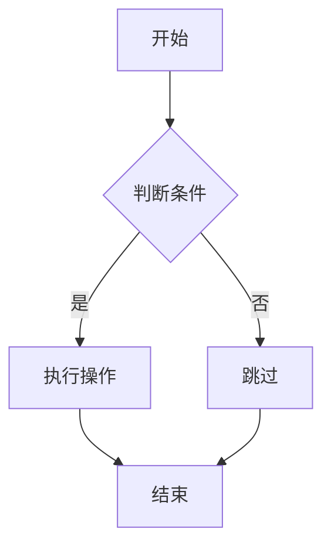
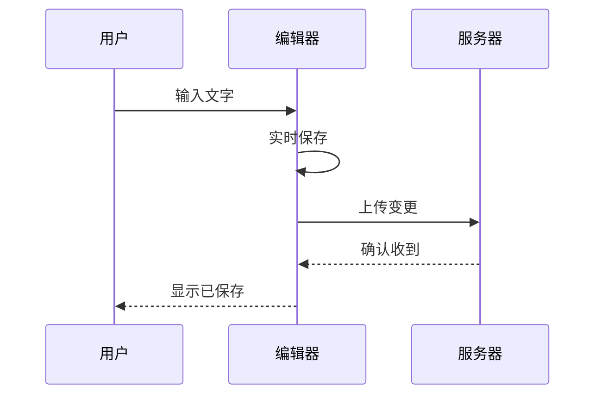
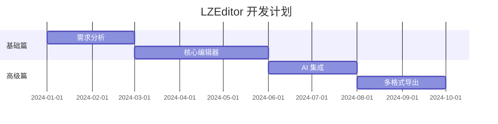

# B06 图表

使用 Mermaid 语法在 Markdown 中绘制流程图、时序图、甘特图等。

---

## 支持的图表类型

| 图表 | 说明 | 示例 |
|------|------|------|
| 流程图 — 展示步骤和决策 | \`flowchart\` |
| 时序图 — 展示对象间交互 | \`sequenceDiagram\` |
| 甘特图 — 展示项目进度 | \`gantt\` |
| 类图 — 展示类结构关系 | \`classDiagram\` |
| 状态图 — 展示状态流转 | \`stateDiagram\` |
| 饼图 — 展示占比数据 | \`pie\` |
| ER 图 — 展示实体关系 | \`erDiagram\` |

---

## 流程图示例



---

## 时序图示例



---

## 甘特图示例



---

## 在 LZEditor 中使用

### 方式一：Mermaid 代码块

在代码块中指定语言为 \`mermaid\`：

````markdown

````

### 方式二：斜杠命令

输入 \`/\` → 选择「插入图表」→ 选择图表类型 → 编辑内容。

---

## 渲染条件

| 条件 | 说明 |
|------|------|
| Mermaid 库 — 首次使用自动加载，需联网 |
| 导出 PDF — Mermaid 图表内嵌为 SVG |
| 导出 HTML — 保留 Mermaid 源码，浏览器渲染 |
| 离线模式 — 图表无法渲染，显示源码 |

---

## 常见问题

**Q：图表不显示？**
A：检查网络连接（需加载 Mermaid CDN），或确认代码块语言为 \`mermaid\`。

**Q：导出后图表变成图片？**
A：PDF 导出会将图表内嵌为矢量 SVG，放大不失真。

**Q：支持 PlantUML 吗？**
A：暂不支持，计划后续版本添加。
